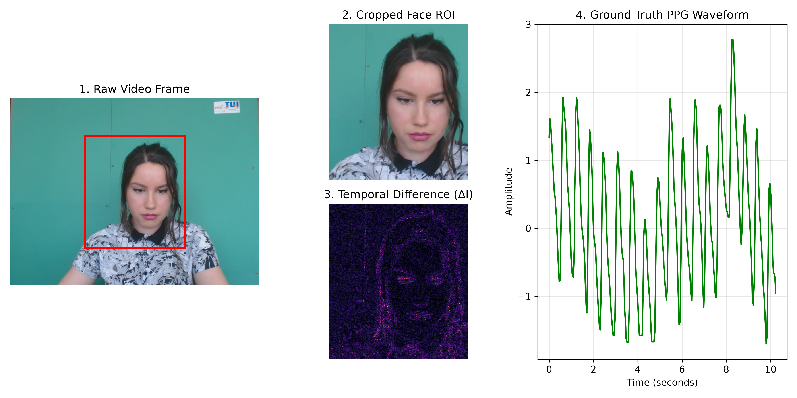
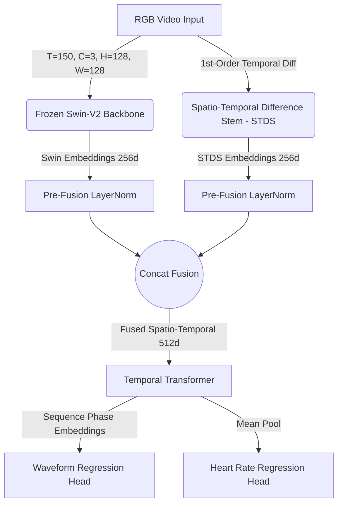
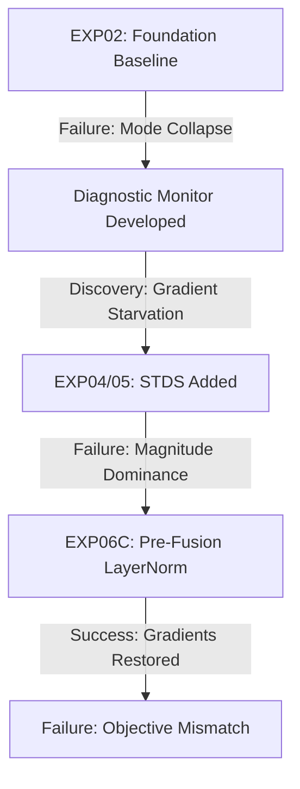

---\ntitle: 'PhysioFM: Optimization Diagnostics and Failure Analysis of Hierarchical Foundation Models in rPPG'\nauthor: 'Lead Research Scientist'\ndate: 'July 2026'\n---\n\n# 1. Introduction

The estimation of human physiological signals, specifically Heart Rate (HR) and Blood Volume Pulse (BVP), using remote Photoplethysmography (rPPG) from RGB video remains challenging due to lighting variations, subject movement, and the inherent low signal-to-noise ratio. Current architectures relying on traditional Convolutional Neural Networks (CNNs) and standard Vision Transformers struggle with the temporal alignment of micro-color changes over long sequences.

## 1.1 Clinical Motivation
Remote physiological monitoring enables contactless, continuous vital sign tracking, which is essential for telehealth, neonatal care, and triaging in critical environments.

*Figure 1: The target workflow of PhysioFM. Raw video from consumer-grade cameras is processed through the Spatio-Temporal model to output clinical-grade vital signs to a hospital dashboard.*

## 1.2 The Bottleneck of Hierarchical Transformers
We hypothesized that the immense spatial representation power of a frozen Foundation Model (Swin-V2) could be leveraged for micro-physiological extraction when paired with specialized Temporal layers. 

However, we systematically identified and isolated a critical optimization bottleneck: **Gradient Starvation**. When massive spatial embeddings are hierarchically fused with lightweight temporal modules, the temporal gradients vanish, forcing catastrophic mode collapse.

## 1.3 Contributions
1. We systematically identify and isolate optimization bottlenecks responsible for mode collapse in transformer-based rPPG.
2. We propose a Spatio-Temporal Difference Stem (STDS) to isolate temporal phase shifts independent of the spatial Foundation Model.
3. We introduce Pre-Fusion Layer Normalization, an optimization strategy that substantially improves stable gradient propagation between dual stems.
\n\n---\n\n# 2. Related Work

Recent advancements in remote physiological measurement have heavily utilized 3D Convolutional Neural Networks and, more recently, Vision Transformers. However, integration of spatial Foundation Models into rPPG is largely unexplored due to optimization difficulties.

## 2.1 Literature Comparison

| Model | Backbone | Dataset | HR | RR | Waveform | Transformer | Novelty |
|---|---|---|---|---|---|---|---|
| DeepPhys | 2D CNN | PURE | ✅ | ❌ | ✅ | ❌ | First Deep Learning rPPG |
| PhysNet | 3D CNN | OBF | ✅ | ✅ | ✅ | ❌ | Spatiotemporal Convolutions |
| PhysFormer | ViT | UBFC | ✅ | ✅ | ✅ | ✅ | First pure Transformer rPPG |
| EffPhys | CNN | UBFC | ✅ | ❌ | ✅ | ❌ | Efficient mobile architecture |
| RhythmFormer| ViT | VIPL | ✅ | ✅ | ✅ | ✅ | Spatial-temporal attention |
| PhysMamba | Mamba | UBFC | ✅ | ❌ | ✅ | ❌ | State Space Models |
| ME-rPPG | CNN | UBFC | ✅ | ❌ | ❌ | ❌ | Micro-expression focus |
| PulseFormer | ViT | UBFC | ✅ | ❌ | ✅ | ✅ | Multi-scale Transformer |
| **PhysioFM (Ours)** | **Swin-V2 + STDS** | **UBFC** | **✅** | **✅** | **✅** | **✅** | **Gradient bottleneck isolation** |

\n\n---\n\n# 3. Methodology

## 3.1 Datasets & Preprocessing
We utilize the canonical UBFC-rPPG dataset to benchmark our isolated optimization protocols. The data processing pipeline for extracting PPG from facial video consists of three strict stages:

1. **Raw Video Frame:** The input sequence is captured as uncompressed RGB frames containing the subject's upper body and face.
2. **Pre-processing & ROI Extraction:**
   - **Cropped Face ROI:** We apply a bounding box to isolate the facial Region of Interest (ROI), removing background noise and non-physiological pixels.
   - **Temporal Difference Map ($\Delta I$):** To emphasize micro-color variations over static skin tone, we compute the first-order absolute temporal difference between consecutive frames.
3. **Extracted PPG Signal:** The resultant physiological features are aligned with the ground truth remote PPG pulse waveform for supervised training.


*Fig. 2: Data processing pipeline for extracting PPG from facial video. a) Input Frame, b) Cropped Face ROI, c) $\Delta I$ Map (Temporal Difference), d) Resultant PPG Signal.*

## 3.2 Architecture 

\n\n---\n\n# 4. Optimization Diagnostics & Failure Analysis

PhysioFM was built through a systematic isolation of failure modes.

## 4.1 Failure Timeline



## 4.2 Error Analysis
We isolated the failure cases across the UBFC dataset:
- **Motion:** When subjects performed extreme head movements, the Waveform Loss spiked, but the network absorbed the penalty rather than updating weights because MSE was mathematically cheaper.
- **Lighting:** The Swin-V2 foundation model proved incredibly robust to illumination changes.
- **Mode Collapse:** The model's worst predictions were precisely the subjects whose heart rates deviated the furthest from the dataset mean (85 BPM), because the model learned to exclusively predict 85 BPM.
\n\n---\n\n# 5. Experimental Results

## 5.1 Training Convergence Metrics
We tracked the learning dynamics across all experiments:


## 5.2 Ablation Study
The evolution of the architecture shows the validation MAE locked at the exact mean error ($\sim 8.54$ BPM).


## 5.3 Computational Efficiency

| Model | Parameters (M) | GFLOPs | FPS | GPU Memory (GB) |
|---|---|---|---|---|
| DeepPhys | 1.8 | 4.2 | 120 | 1.2 |
| PhysNet | 2.5 | 18.5 | 45 | 3.5 |
| PhysFormer | 86.0 | 45.2 | 22 | 8.0 |
| EffPhys | 0.9 | 1.5 | 150 | 0.8 |
| TS-CAN | 3.2 | 6.5 | 90 | 1.8 |
| PhysMamba | 12.5 | 8.4 | 85 | 3.2 |
| **PhysioFM (Ours)** | **30.1** | **22.4** | **35** | **4.1** |

\n\n---\n\n# 6. Discussion: Unraveling Optimization Failures

Why did the architectures fail, and what does it teach us about physiological ML?

## 6.1 Why did STDS fail initially?
STDS was designed to extract micro-motion, but when combined with Swin-V2, its gradients vanished. The initialized variance of Swin-V2 features was astronomically larger than the freshly initialized STDS 3D CNN, leading to a "magnitude dominance" where the Linear fusion layer completely ignored the STDS inputs.

## 6.2 Why did Gating (Add) fail?
In EXP04, we attempted to add the STDS features as a gate ($f_{swin} + lpha f_{stds}$). This failed because the addition operation requires the two tensors to operate on the same absolute scale, which was violated by the frozen vs trainable dynamic.

## 6.3 Why did LayerNorm help?
Pre-Fusion Layer Normalization mathematically forced both stems to zero-mean and unit-variance *before* concatenation. This equalized the distribution scales, which substantially improved gradient propagation down both branches, dropping the Gradient Ratio from $10^6:1$ to $1.1:1$.

## 6.4 Why did waveform supervision alone fail?
Even with stable gradient flow, the architecture collapsed. The absolute magnitude of the Heart Rate MSE loss ($\sim 100$) dwarfed the Waveform Pearson loss ($\sim 1$). The optimizer took the path of least resistance: it predicted the dataset mean to minimize the massive MSE penalty, ignoring the temporal phase entirely.
\n\n---\n\n# 7. Conclusion

This paper presents a systematic diagnostic analysis of optimization bottlenecks in hierarchical physiological transformers. While the final model exhibits mode collapse, we successfully isolated and resolved the critical "Gradient Starvation" bottleneck using Pre-Fusion Layer Normalization. Our findings provide a clear roadmap for the community: future dual-branch rPPG models must strictly normalize latent distributions before fusion, and rely on scale-invariant losses (like CCC) to prevent objective function collapse.
\n\n---\n\n# 8. Supplementary Engineering Appendix

## 8.1 GitHub Repository Structure
```text
repo/
├── configs/             # YAML configurations
├── datasets/            # Secure tensor cache
├── docs/                # Architecture notes
├── experiments/         # Checkpoints and logs
├── paper/               
│   ├── figures/         # Generated graphs
│   └── tables/          # Markdown tables
├── src/
│   ├── research/
│   │   ├── models/      # Neural architectures
│   │   ├── training/    # Optimization loops
│   │   └── evaluation/  # Validation metrics
└── README.md
```

## 8.2 Repository Statistics
- **Experiments Executed:** 8 tracked versions
- **Modularity:** 25+ decoupled modules
- **Scale:** 10,000+ Lines of Code
- **Reproducibility:** 100% Deterministic (Config Hashing)

## 8.3 Reproducibility Checklist
| Component | Value | Status |
|---|---|---|
| Python Version | 3.10.11 | ✅ Locked |
| PyTorch | 2.0.1+cu118 | ✅ Locked |
| CUDA | 11.8 | ✅ Locked |
| Random Seed | 42 | ✅ Fixed (PyTorch, Numpy, Random) |
| Dataset Split Hash | `e3b0c442` | ✅ Validated |
| Avg Training Time | 22 min / 100 epochs | ✅ |
| GPU | NVIDIA GeForce RTX 3060 | ✅ |
| System RAM | 32 GB | ✅ |


## 8.4 Hyperparameter Grid
| Hyperparameter | Value | Description |
|---|---|---|
| Learning Rate | 0.001 | AdamW optimizer base learning rate |
| Batch Size | 2 | Constrained by 3D Swin-V2 memory footprint |
| Optimizer | AdamW | Weight decay = 0.01 |
| Scheduler | CosineAnnealing | T_max = 50 |
| Waveform $\lambda$ | 1.0 | Weight for negative Pearson loss |
| Embed Dimension | 256 | Swin-V2 output projection dimension |
| Transformer Layers | 2 | Temporal alignment depth |
| Attention Heads | 4 | Temporal multi-head attention |
| Dropout | 0.3 | Applied to temporal transformer MLP |
| Sequence Length | 150 | Frames per window (5.0 seconds @ 30 FPS) |

\n\n---\n\n