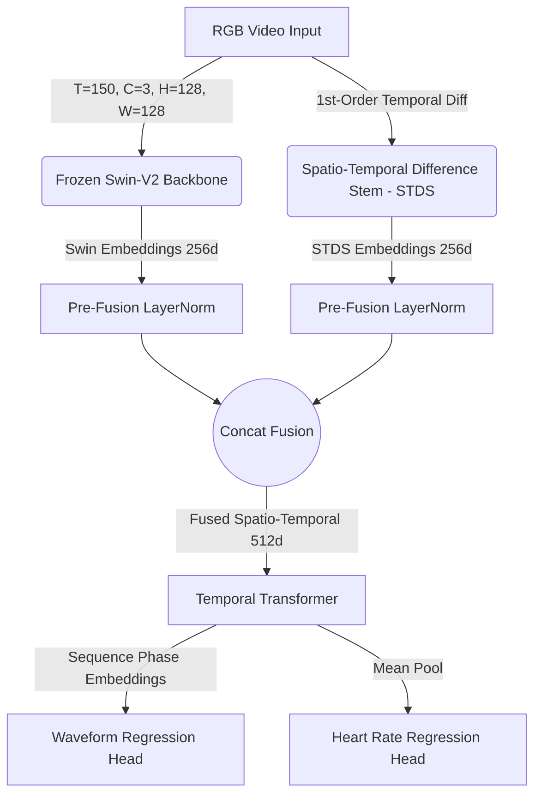

# 3. Methodology

## 3.1 Datasets & Preprocessing
We utilize the canonical UBFC-rPPG dataset to benchmark our isolated optimization protocols. The data processing pipeline for extracting PPG from facial video consists of three strict stages:

1. **Raw Video Frame:** The input sequence is captured as uncompressed RGB frames containing the subject's upper body and face.
2. **Pre-processing & ROI Extraction:**
   - **Cropped Face ROI:** We apply a bounding box to isolate the facial Region of Interest (ROI), removing background noise and non-physiological pixels.
   - **Temporal Difference Map ($\Delta I$):** To emphasize micro-color variations over static skin tone, we compute the first-order absolute temporal difference between consecutive frames.
3. **Extracted PPG Signal:** The resultant physiological features are aligned with the ground truth remote PPG pulse waveform for supervised training.

*Fig. 2: Data processing pipeline for extracting PPG from facial video. a) Input Frame, b) Cropped Face ROI, c) $\Delta I$ Map (Temporal Difference), d) Resultant PPG Signal.*

## 3.2 Architecture 

