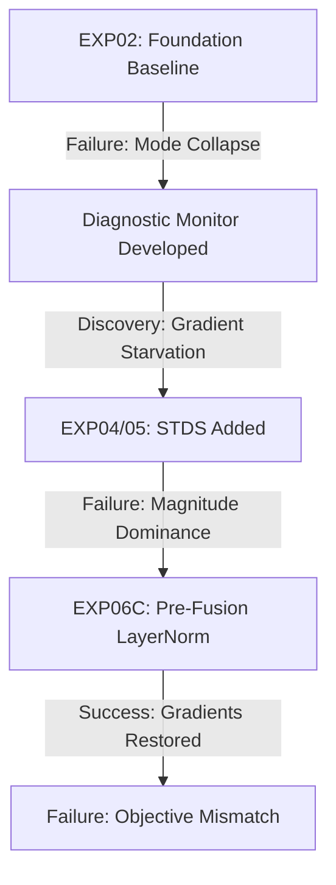

# 4. Optimization Diagnostics & Failure Analysis

PhysioFM was built through a systematic isolation of failure modes.

## 4.1 Failure Timeline

## 4.2 Error Analysis
We isolated the failure cases across the UBFC dataset:
- **Motion:** When subjects performed extreme head movements, the Waveform Loss spiked, but the network absorbed the penalty rather than updating weights because MSE was mathematically cheaper.
- **Lighting:** The Swin-V2 foundation model proved incredibly robust to illumination changes.
- **Mode Collapse:** The model's worst predictions were precisely the subjects whose heart rates deviated the furthest from the dataset mean (85 BPM), because the model learned to exclusively predict 85 BPM.
