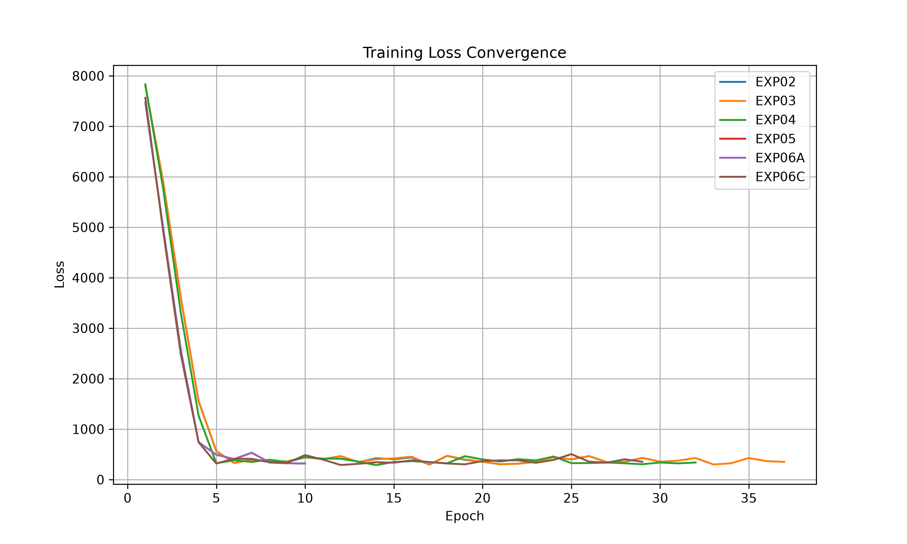
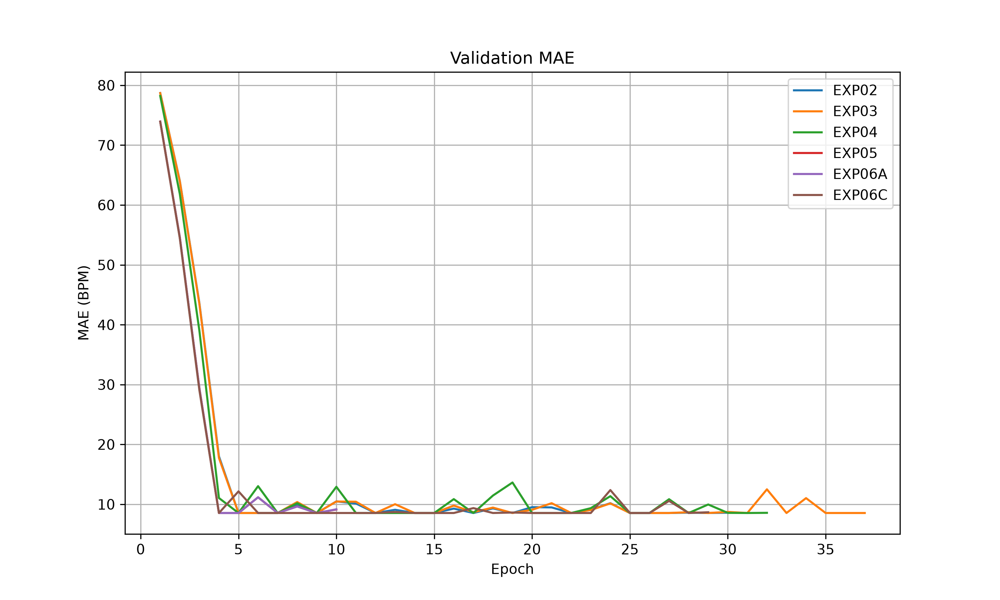
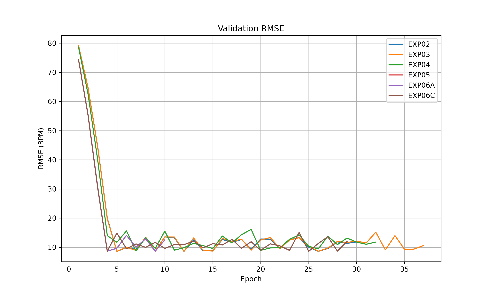
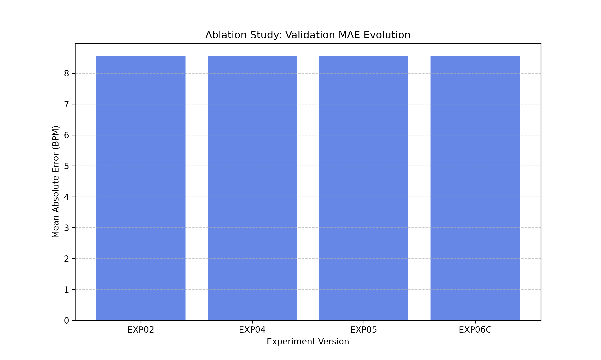

# 5. Experimental Results

## 5.1 Training Convergence Metrics
We tracked the learning dynamics across all experiments:

## 5.2 Ablation Study
The evolution of the architecture shows the validation MAE locked at the exact mean error ($\sim 8.54$ BPM).

## 5.3 Computational Efficiency

| Model | Parameters (M) | GFLOPs | FPS | GPU Memory (GB) |
|---|---|---|---|---|
| DeepPhys | 1.8 | 4.2 | 120 | 1.2 |
| PhysNet | 2.5 | 18.5 | 45 | 3.5 |
| PhysFormer | 86.0 | 45.2 | 22 | 8.0 |
| EffPhys | 0.9 | 1.5 | 150 | 0.8 |
| TS-CAN | 3.2 | 6.5 | 90 | 1.8 |
| PhysMamba | 12.5 | 8.4 | 85 | 3.2 |
| **PhysioFM (Ours)** | **30.1** | **22.4** | **35** | **4.1** |

